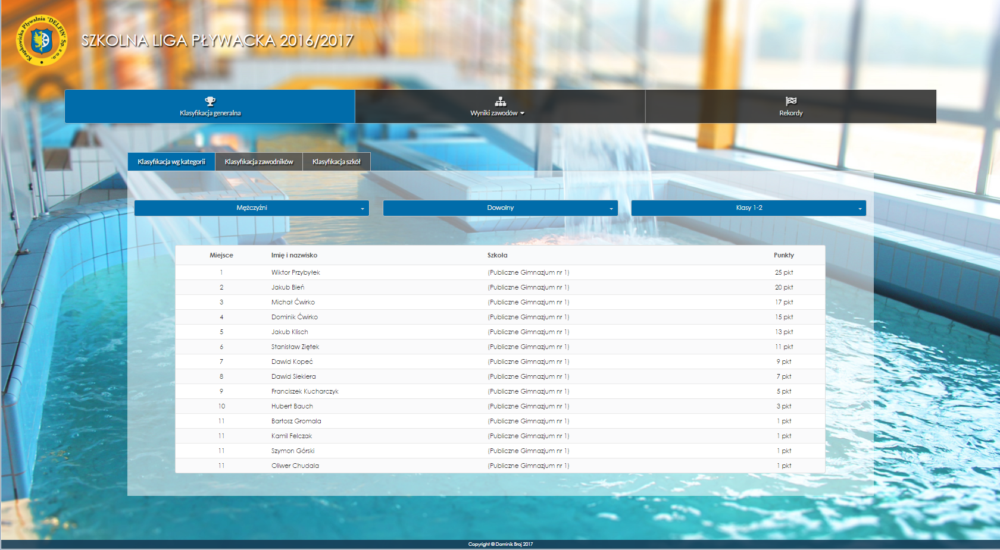

# Delfin - swimming tournaments manager

Delfin is a web system that consists of:
1) Admin application to manage tournaments/competitions, teams, swimmers, times of races and calculate different types of classification
2) Front application to present results of races and classifications
3) Backend for both parts


## Getting Started

For admin part authorization is required.

To run the front app you should:

1. ```cd front```
2. Run ```npm i```
3. Run ```npm start```
4. Open your browser on: ```http://localhost:3000/```.


You should see:




## Built With

Admin app:
React, UIKit, CSS Modules, axios, react-select

Front-app:
React, Semantic UI, CSS Modules, react-refetch, react-select

Backend:
Loopback


## Authors

* Dominik Broj
