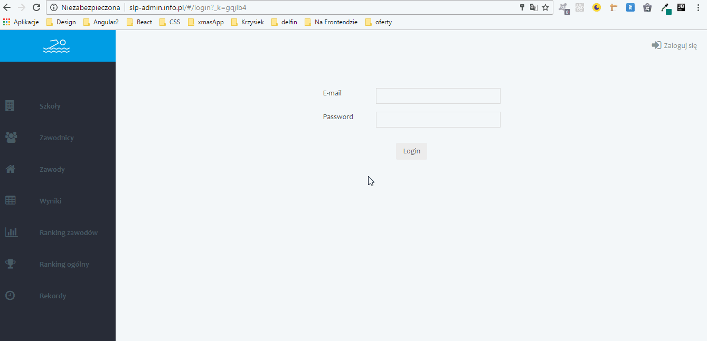

# Instrukcja

Instrukcja panelu administracyjnego systemu do obliczania wyników szkolnej ligi pływackiej.
  

### 1. Wejdź na stronę: [www.slp-admin.info.pl](http://slp-admin.info.pl)  

### 2. Zaloguj się

  

### 3. Dodaj szkoły
Zapisane szkoły będą dostępne niezależnie od zawodów, których wyniki będą wpisywane. Możesz również edytować i kasować szkoły. Dodatkowo możesz zdecydować czy dana szkoła/klub ma być brana pod uwagę w klasyfikacjach.

  

### 4. Dodaj zawodników i przypisz ich do szkół
Zapisani zawodnicy będą dostępni niezależnie od zawodów, których wyniki będą wpisywane. Zawsze zaznacz szkołę/klub zapisywanego zawodnika. Unikaj zapisywania duplikatów. Możesz również edytować i kasować zawodników.

  

### 5. Przypisz zawodników do zawodów
Przypisz zawodników do zawodów, w których biorą udział

  

### 6. Wybierz zawody, których wyniki będziesz wpisywał
Dodatkowo możesz edytować domyślną punktację zawodów.

  

### 7. Wpisz wyniki
W sekcji wyniki wybierz kategorię, w której wpisesz wyniki, a następnie wybierz i wpisz wynik zawodnika

  

### 8. Przeglądaj rankingi aktualnych zawodów

  

### 9. Przeglądaj klasyfikację generalną wszystkich zawodów

  

### 10. Przeglądaj rekordy

  

### 10. Wszystkie wyniki dostępne są na stronie: [www.slp-krapkowice.info.pl](http://slp-krapkowice.info.pl)

  

